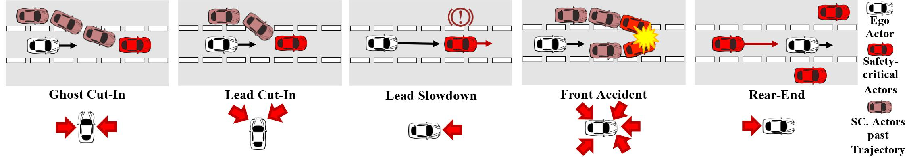

+++
author = "Ziheng (Jack) Chen"
title = "iPrism: Characterize and Mitigate Risk by Quantifying Change in Escape Routes"
description = "Accepted DSN 2024"
series = ["Projects"]
toc = false

+++

## DEPEND Bench: Simulating Safety-Critical Scenarios
To rigorously test autonomous driving techniques, we generate simulated safety-critical scenarios using the CARLA Simulator. These scenarios are based on the National Highway Traffic Safety Administration (NHTSA) pre-crash scenario typology report, which outlines common accident scenarios. Our goal is to ensure that autonomous driving systems are evaluated under challenging conditions that mirror real-world safety threats.

### Scenario Typologies
A scenario typology provides a high-level description of a safety-critical situation. We selected five top-ranking scenario typologies based on fatality rates from the NHTSA report. These typologies represent different safety threats relative to the ego vehicle (the autonomous vehicle being tested). 

 

1. **Ghost Cut-in**: An actor approaches from behind in an adjacent lane and abruptly cuts into the ego vehicle's lane.
2. **Lead Cut-in**: An actor in front of the ego vehicle in an adjacent lane cuts into the ego vehicle's lane.
3. **Lead Slowdown**: An actor in front of the ego vehicle in the same lane slows down or stops.
4. **Front Accident**: Two actors in front of the ego vehicle in different lanes collide due to a merging conflict.
5. **Rear-end**: An actor approaches the ego vehicle from behind and collides with it.
Each typology accounts for a significant portion of accidents in the U.S., with detailed threat directions illustrated in our diagrams.

### Scenario Generation
Each safety-critical scenario is an instantiation of a scenario typology with specific hyperparameters. By varying these hyperparameters, we simulate a wide range of conditions to test the robustness of autonomous driving systems.We generated a total of 4810 safety-critical scenarios across the five typologies. The table below summarizes the number of scenarios, their hyperparameters, and the number of accidents encountered by a baseline agent (LBC).

| Scenario Typology | # of Scenarios | Hyperparameters | # of Baseline Accidents |
|-------------------|--------------------------|-------------------------|---------------------------------------|
| Ghost Cut-in      | 1000                     | Distance same lane, Distance lane change, Speed lane change | 519 |
| Lead Cut-in       | 1000                     | Event trigger distance, Distance lane change, Speed lane change | 170 |
| Lead Slowdown     | 1000                     | NPC vehicle location, NPC vehicle speed, Event trigger distance | 118 |
| Front Accident    | 810                      | Distance lane change, Distance same lane, Event trigger distance | 0 |
| Rear-end          | 1000                     | NPC vehicle 1 speed, NPC vehicle 2 speed, NPC vehicle 1 location | 770 |

### SMC Training
From each typology, one scenario is selected for training the reinforcement learning (RL)-based controller. This scenario is chosen based on its representativeness and the level of risk shortly before an accident occurs. The front-accident typology is excluded from training and evaluation as none of the scenarios resulted in an accident.

### STI Testing in Real-World Dataset
To validate our approach, we also apply our safety-critical scenario identification method to the Argoverse real-world dataset. This dataset includes over 50 driving sequences and 300K actor annotations. Our method helps identify interesting, safety-critical scenarios within real-world data, highlighting potential biases towards less hazardous situations due to the controlled environments in which the data are typically collected.
