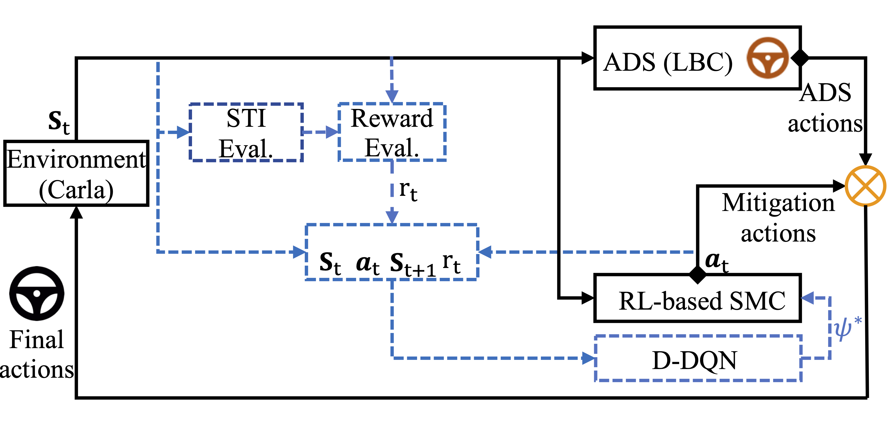

+++
author = "Ziheng (Jack) Chen"
title = "iPrism: Characterize and Mitigate Risk by Quantifying Change in Escape Routes"
description = "Accepted DSN 2024"
series = ["Projects"]
toc = false

+++

## Mitigating Risk
### Safety Mitigation Controller (SMC)
We constantly assess the risk of the traffic with STI. Using the risk, we train an Safety Mitigation Controller (SMC) using reinforcement learning. During training, the SMC takes in the current risk in addition to the input for the ADS to learn to brake to obtain a higher reward. As a result, during inference, the SMC mitigates the imminent accident by braking based on the scene risk with only the input for the ADS. 

  
When determines to brake, the SMC overwrites the original decision by the ADS.

### SMC in Action
  
Without SMC intervention, an accident occurs when another actor aggressively cuts in.

  
The SMC successfully mitigates the accident by braking when the risk is high. 

*The above scenario is the ghost cut-in scenario #225 with parameters `{"distance_same_lane": 12, "distance_lane_change": 8, "speed_lane_change": 14}` and can be reproduced.*

### Results
| Agent                                             | Explanations and Reasons for Comparison                                               | Ghost cut-in CA% | Lead cut-in CA% | Lead slowdown CA% |
|---------------------------------------------------|----------------------------------------------------------------------|------------------|-----------------|-------------------|
| **LBC+SMC w/ STI**            | Adding SMC with STI to show improvement over baseline LBC agent.                             | 49%              | 98%             | 87%               |
| LBC+SMC w/o STI                            | Adding SMC without STI to show that STI is important for SMC (ablation study).                    | 1%               | 2%              | 86%               |
| LBC+TTC-based (ACA)                               | Adding SMC with TTC to show improvement w.r.t. ACA techniques.                           | 0%               | 0%              | 92%               |
| **RIP+SMC w/ STI**            | Using RIP agent instead of LBC agent to show generalization with other agents.                            | 86%              | 61%             | 71%               |

The above table shows the effectiveness of SMC in mitigating accidents comparing to other state-of-the-art methods. **CA% (collision avoidance)** stands for the percentage of accident scenarios prevented by the mitigation strategy. 

SMC significantly enhances safety, reducing accident occurrences by 37% to 98% compared to a baseline Learning-by-Cheating (LBC) agent. Additionally, SMC achieves up to 72.7% accident prevention when compared to state-of-the-art safety hazard mitigation agents.

